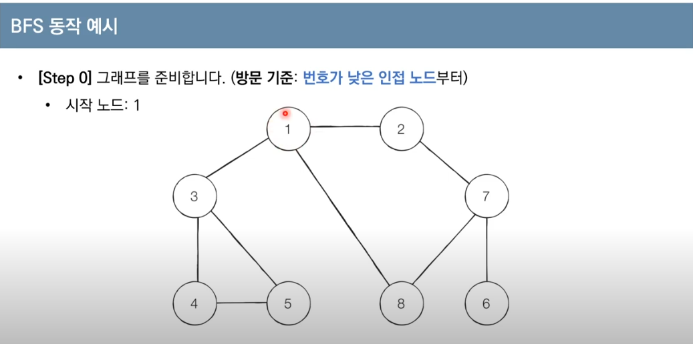
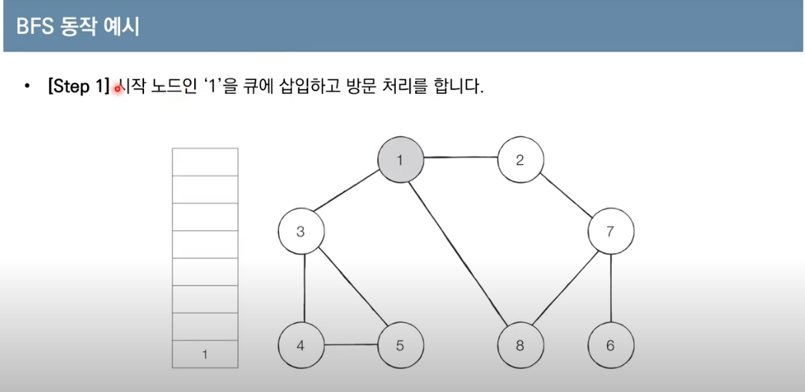
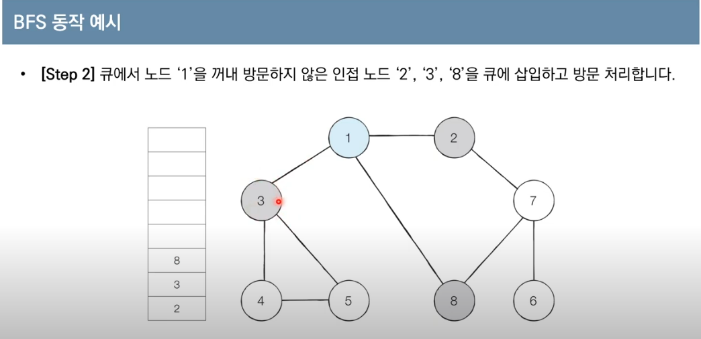
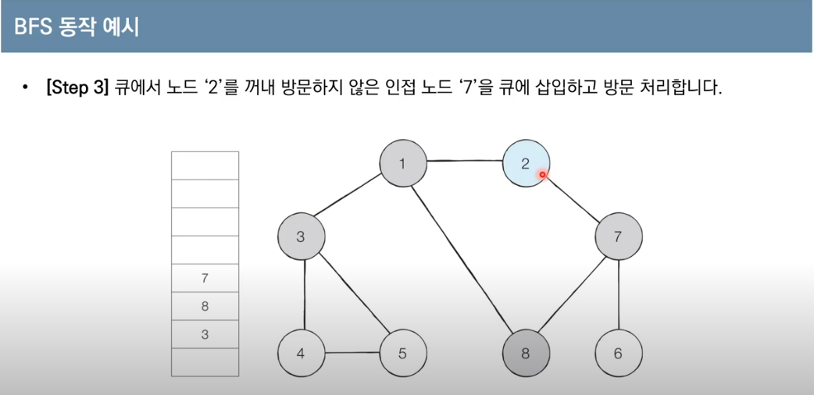
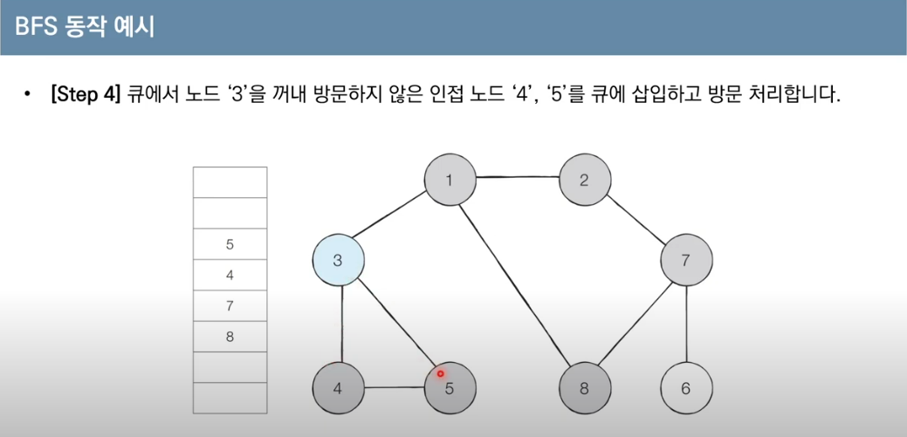
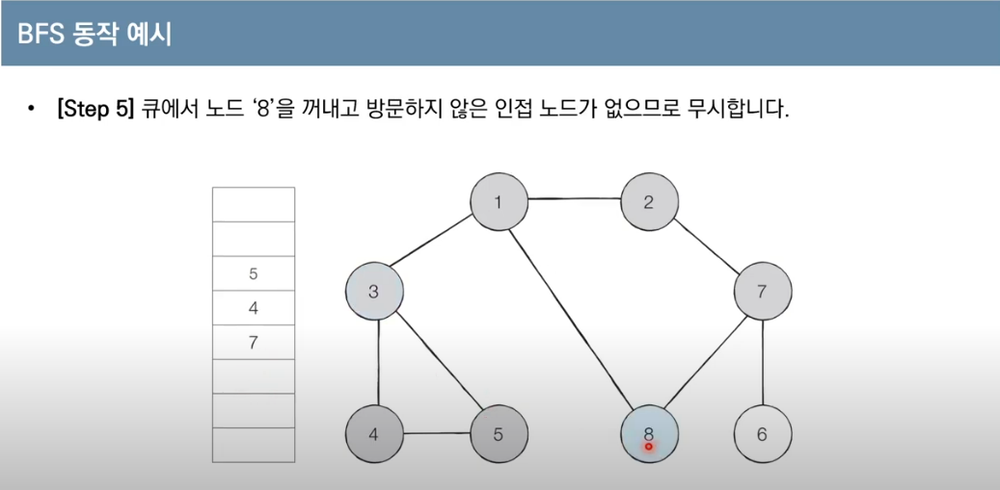
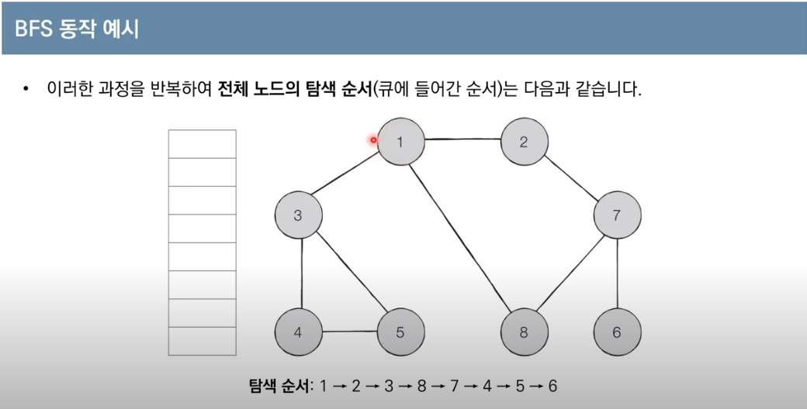

# BFS(Breadth-First Search)
- BFS는 너비 우선 탐색이라고도 부르며, 그래프에서 가까운 노드부터 우선적으로 탐색하는 알고리즘이다.
- BFS는 큐 자료구조를 이용하며, 동작과정은 다음과 같다.

### 동작 과정
1. 탐색 시작 노드를 큐에 삽입하고, 방문 처리를 한다.
2. 큐에서 노드를 꺼낸 뒤 해당 노드의 인접 노드 중 
방문하지 않은 노드를 모두 큐에 삽입하고 방문 처리한다.
3. 더 이상 2번의 과정을 수행할 수 없을 떄까지 반복한다.

### 예시

