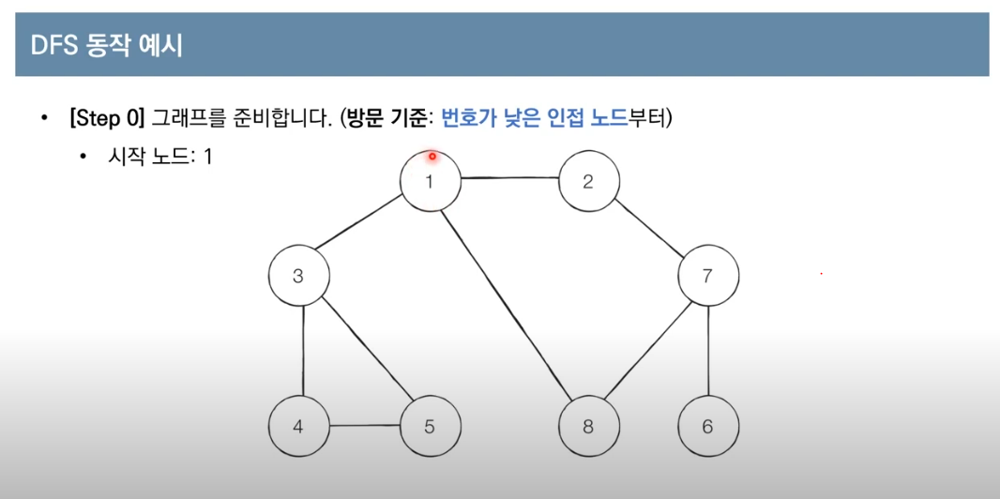
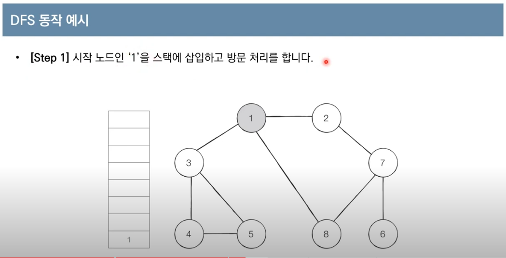
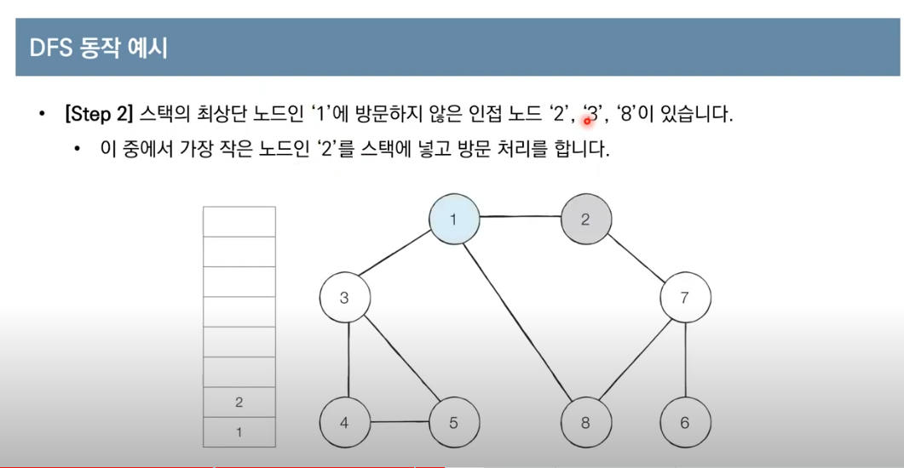
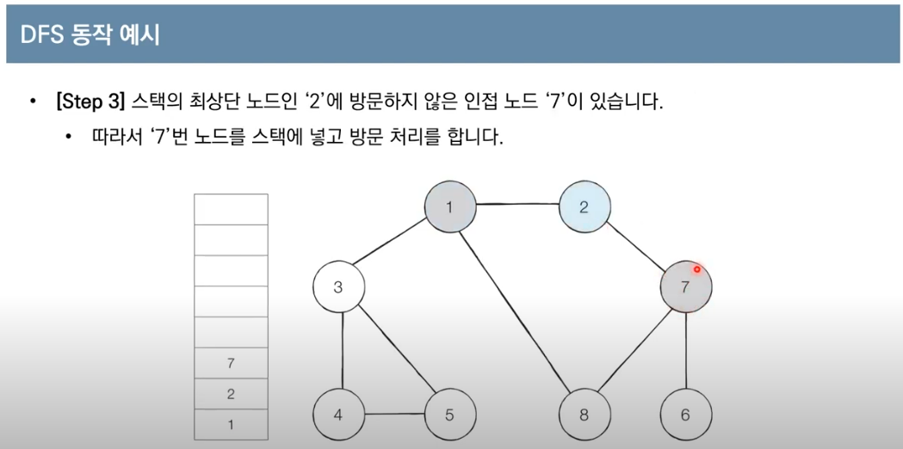
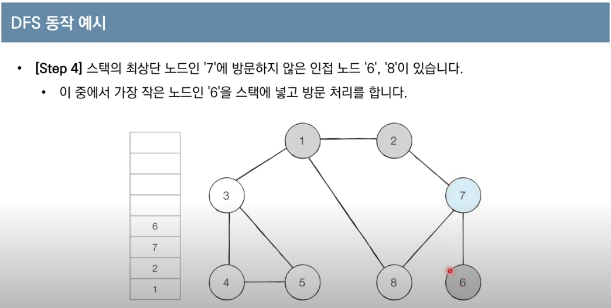
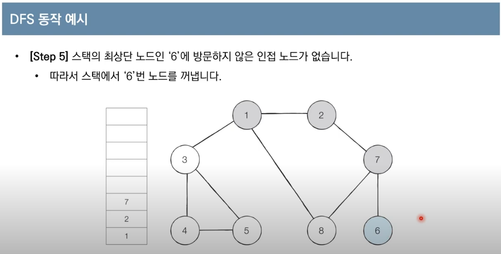
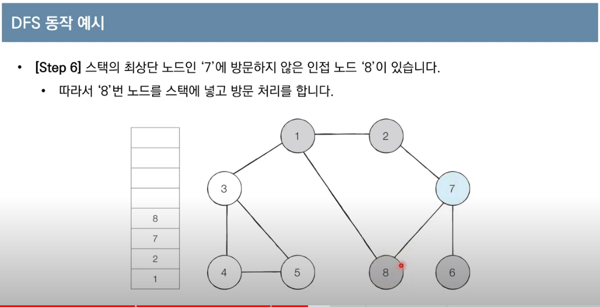
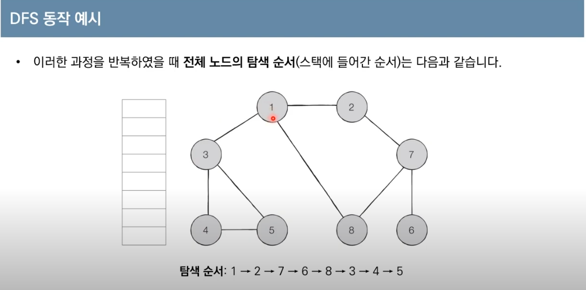

# DFS
- DFS는 깊이 우선 탐색이라고도 부르며, 그래프에서 깊은 부분을 우선적으로 탐색하는 알고리즘이다.
- DFS는 스택 자료구조(혹은 재귀 함수)를 이용하며, 동작과정은 다음과 같다.

### 동작 과정
1. 탐색 시작 노드를 스택에 삽입하고, 방문 처리를 한다.
2. 스택의 최상단 노드에 방문하지 않은 인접한 노드가 하나라도 있으면, 그 노드를 스택에 넣고 방문 처리를 한다.
방문하지 않은 인접 노드가 없으면 스택에서 최상단 노드를 꺼낸다.
3. 더 이상 2번의 과정을 수행할 수 없을 떄까지 반복한다.

### 예시

